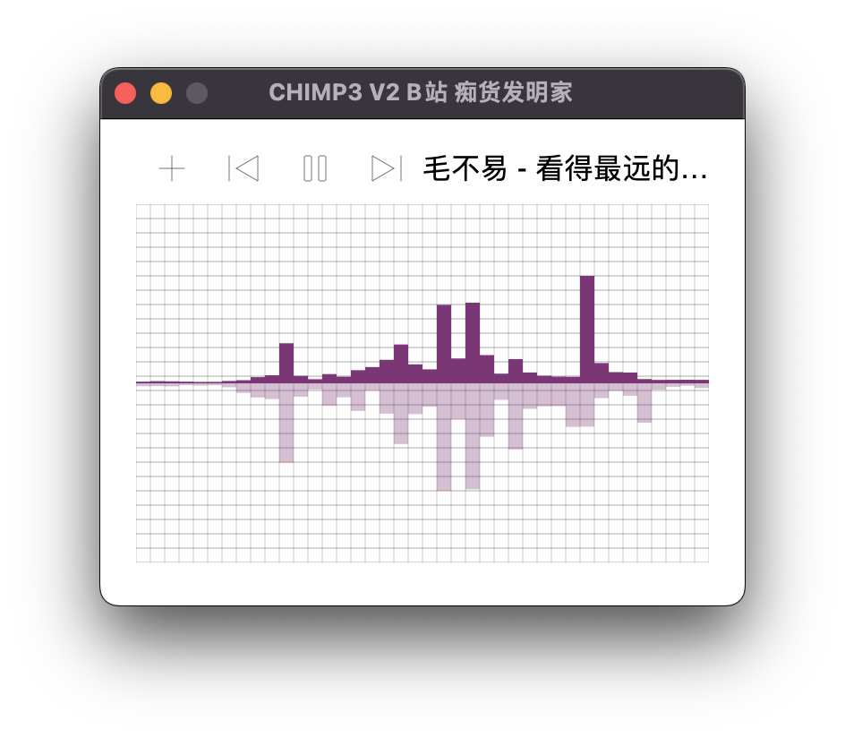

# CHIMP3 V2

一款跨平台 支持 mac / win 的MP3播放器




## 目录

 - [功能](#功能)
 - [编译](#编译)
 - [代码结构](#代码结构)
 - [安装包下载](#安装包下载)

## 功能

* 左键单击频谱界面进行多频谱切换，目前支持4种模式
* 单曲暂停/继续
* 多曲连续播放
* 上一首/下一首

## 编译

脚本是在mac下的执行脚本，可以交叉编译出windows的安装包

```shell
cd scripts/package
./build_bin.sh && ./build_window.sh
```

编译成功后请在`releases`下找对应的安装文件，分别是：

* chimp3 Setup 2.0.0.exe (win 64)
* CHIMP3-2.0.0-arm64.dmg (m1)
* CHIMP3-2.0.0.dmg (intel)

## 代码结构

* frontend 前端（react mui d5js 部分）
* backend 背后运行的进程（go-mp3 oto zenity go-dsp langgo 部分）
* window 窗口外壳（electron 部分）


## 安装包下载

https://github.com/langwan/chimp3/releases
